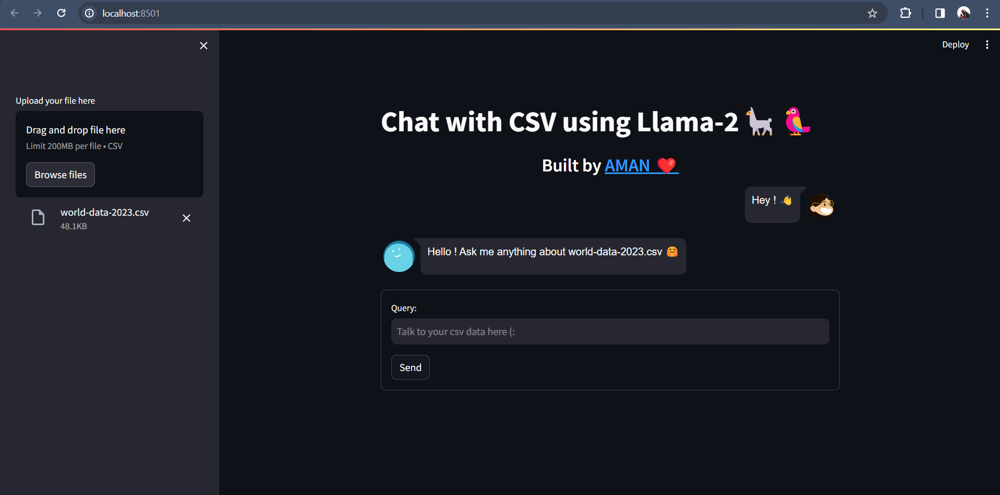

# Chat-with-CSV-using-Llama-2
This is a chatbot where we can upload our CSV on the fly from UI and then ask question according to it. I have used faiss cpu for vector storage

# Tech stack used - 
1. Langchain - For Retrieval QA, loading LLM, loading Hugginface embedding model and vector store
2. Huggingface - For downloading embedding Model
3. CTransformer - For loading Llama2 model
4. Faiss CPU - For storing and retrieving embeddings 
5. Streamlit - To create web interface

# Data -
- Can be uploaded on the fly , for this use case I have used world-data-2023

# Model -
- LLM - Llama-2 7B ggml 8 bit quantized model
- Embedding - all-minilm-v2

# Screenshot of UI - 

